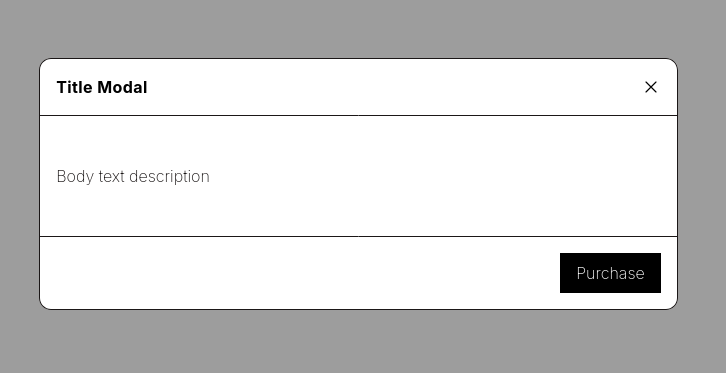

# Ux Modal Bundle with Twig, Alpine JS and Tailwind


[](https://twig.symfony.com/)

## Presentation



A modal component with Tailwind and Alpine JS for Twig from the Penguin UI site : https://www.penguinui.com/components/modal

## Requirements

* PHP >= 8.0
* Twig >= 2.7
* Tailwind CSS >= 3.4
* Alpine JS >= 3
* Composer

## Installation

### Install the bundle

Execute the following [composer](https://getcomposer.org/) command to add the bundle to the dependencies of your
project:

```bash
composer require pixeldev/uxmodal-bundle
```

### Enable the bundle

Enable the bundle by adding it to the list of registered bundles in the `config/bundles.php` file of your project:

 ```php
 return [
     /* ... */
     Pixel\UxModalBundle\UxModalBundle::class => ['all' => true],
 ];
 ```

### Install Tailwind CSS and Alpine JS

See this documentation : https://www.penguinui.com/docs/getting-started

### Add bundle directory for Tailwind compilation 

Open tailwind.config.js and add the following line to the content table

```javascript
'./vendor/pixeldev/uxmodal-bundle/src/Resources/views/**/*.html.twig'
```

## Use
## General use

Here's an example of how to add a modal to your site:

```twig

    {# Label for this button #}
    Open Modal
    {# Title for Modal #}
    Title Modal
    {# Body text for Modal #}
    
        Body text description
    
    {# Add a button on a footer Modal #}
    
        <button @click="modalIsOpen = false" type="button"
                class="{{ primaryButtonClass }} bg-black text-white hover:bg-primary-dark">
           Purchase
        </button>
    

```

## Configurations

Todo